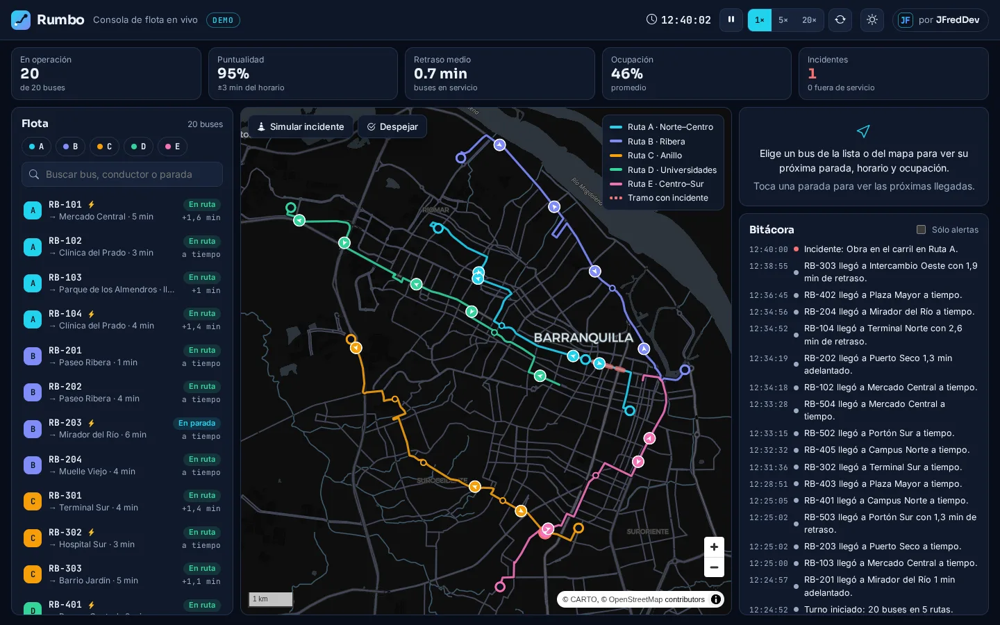
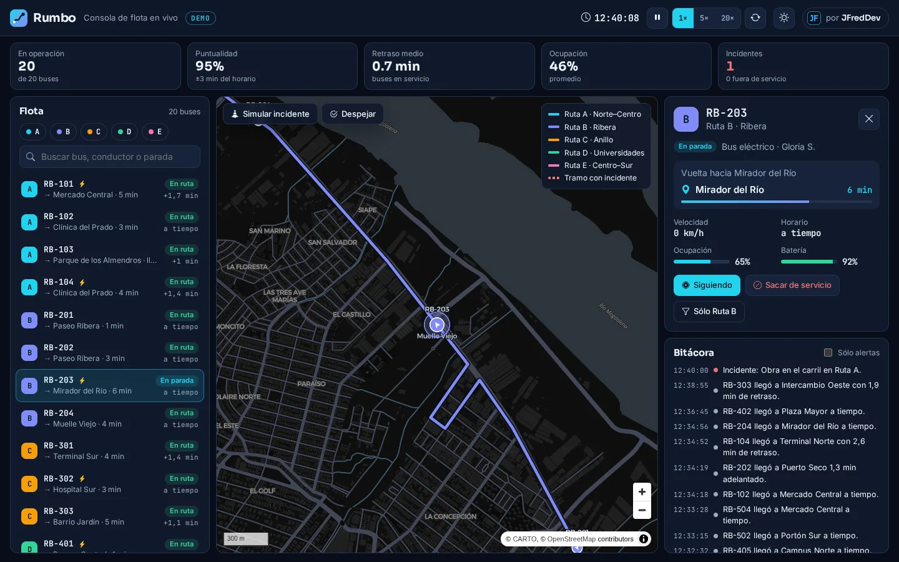
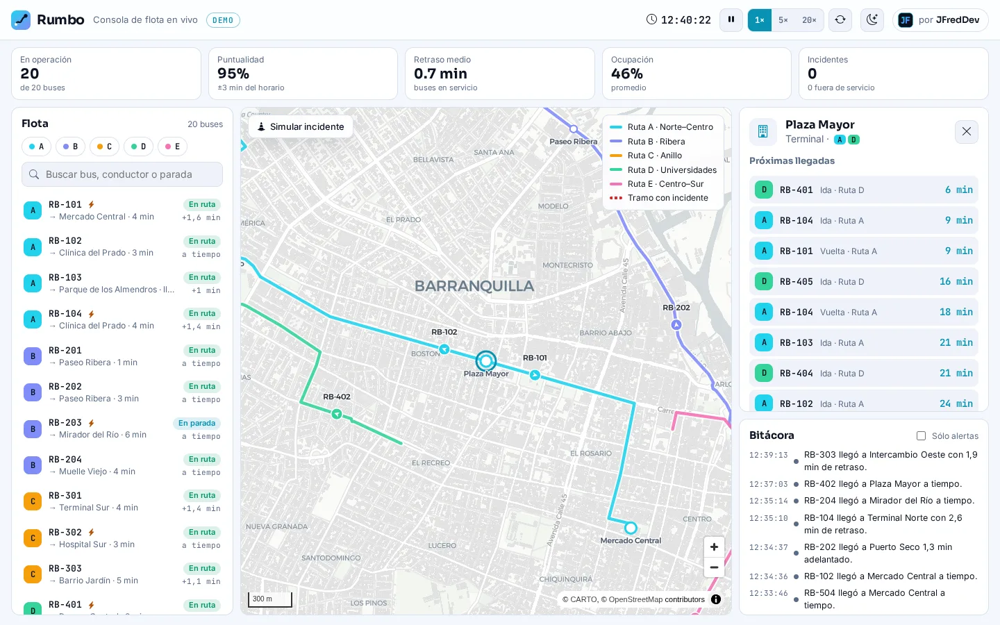
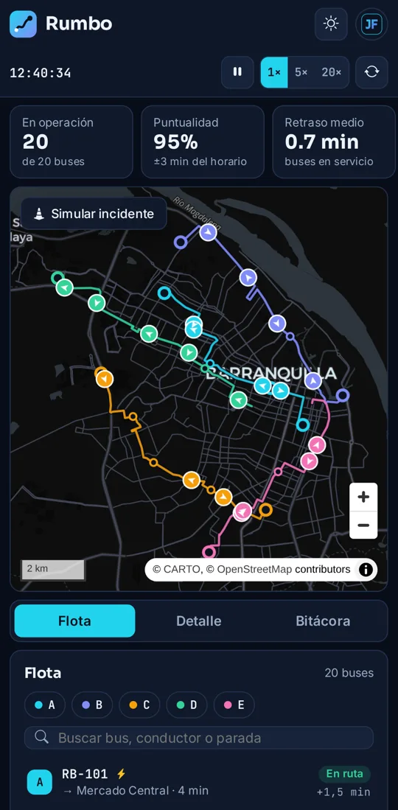
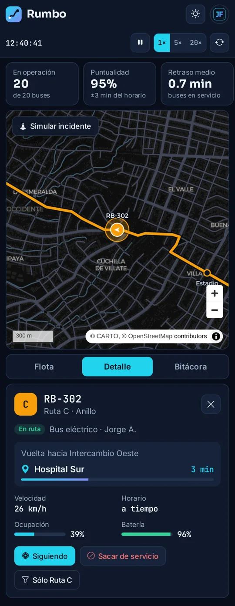

# Rumbo

**Consola de flota en vivo.** Buses que recorren sus rutas sobre el mapa, con próxima parada y ETA, retraso frente al horario, ocupación, batería de los eléctricos, agrupamiento entre buses de la misma ruta e incidentes de tráfico que se pueden simular.

**[Probar la demo →](https://jfredmc.github.io/rumbo/)** · corre entera en tu navegador, sin registro.



## Qué probar

1. Elige un bus en la lista o en el mapa: el mapa lo **sigue** (arrastra el mapa para soltarlo) y el panel muestra próxima parada, ETA, horario, ocupación y batería.
2. **Sacar de servicio** / **Reintegrar** un bus y mira cómo cambian los KPI.
3. Busca una parada (p. ej. «Plaza Mayor») para ver su **tablero de próximas llegadas** en los dos sentidos.
4. **Simular incidente** en una ruta: el tramo se marca en rojo, los buses que lo cruzan van lentos y acumulan retraso. **Despejar** lo quita.
5. Acelera a **5×** o **20×**, pausa, o filtra por ruta. La **bitácora** registra llegadas a terminal, retrasos, recuperaciones, agrupamientos y batería baja.
6. Cambia a tema claro: el mapa pasa de CARTO Dark Matter a Positron.

El estado se guarda en `localStorage`: si recargas, la flota sigue donde iba. **Reiniciar** arranca un turno nuevo.

| Bus seleccionado                                        | Parada, tema claro                                               | Móvil                                                                                                      |
| ------------------------------------------------------- | ---------------------------------------------------------------- | ---------------------------------------------------------------------------------------------------------- |
|  |  |   |

## Datos

Todo es **ficticio**: 5 rutas, 20 buses (`RB-101`…), paradas y conductores inventados. Los trazados siguen calles reales de Barranquilla solo para que se vean creíbles: se generaron una vez con el router público de OSRM sobre datos © colaboradores de OpenStreetMap (ODbL). No vienen de ningún operador de transporte ni lo representan. Teselas © CARTO, sin clave de API.

## Cómo funciona

```
packages/fleet-engine   Motor puro y determinista en TypeScript: red de rutas (ida + vuelta), buses,
                        tráfico, paradas, regulación en terminal, alertas, ETA y KPI. Sin dependencias.
apps/web                Consola Angular 22 (zoneless, signals, OnPush) + MapLibre GL. Modo demo o API.
apps/api                NestJS 11 + Socket.IO: la misma simulación, pero en el servidor.
```

- **Retraso**: se acumula cuando el bus va más lento que la velocidad programada y por las detenciones largas. En terminal el descanso se acorta si viene tarde y se alarga si viene adelantado; si va adelantado, espera en la parada.
- **Agrupamiento**: alerta cuando dos buses de la misma ruta quedan a menos de 300 m.
- **Modo demo** (GitHub Pages): el motor corre en el navegador cada 250 ms y arranca con 15 minutos de operación ya simulados.
- **Modo API**: `FleetService` avanza la flota en el servidor y la publica por Socket.IO (`/fleet`) en cada tick; las acciones se validan con `parseFleetAction` y se limitan por conexión. La consola solo conoce `FleetStore`; `DemoFleetStore` y `ApiFleetStore` son intercambiables. El selector **Demo / API** aparece cuando el build tiene `apiUrl` (en `ng serve`, `http://localhost:3000`). El demo publicado no usa backend.

API REST: `GET /api/health`, `GET /api/fleet`, `GET /api/fleet/vehicles`, `GET /api/fleet/kpis`, `POST /api/fleet/actions`.

## Desarrollo

Requisitos: Node 22 y pnpm 10 (`corepack enable`).

```bash
pnpm install
pnpm --filter @rumbo/fleet-engine build

pnpm --filter @rumbo/web start                # consola en modo demo: http://localhost:4200
pnpm --filter @rumbo/api dev                  # API en http://localhost:3000/api (CORS_ORIGINS, TICK_MS)
# y abre http://localhost:4200/?mode=api
```

## Calidad

```bash
pnpm lint && pnpm typecheck && pnpm test      # motor (Vitest), web (Vitest), API (Jest)
pnpm --filter @rumbo/api test:e2e             # HTTP + Socket.IO
pnpm --filter @rumbo/web build:pages && pnpm --filter @rumbo/web e2e    # Playwright, escritorio + móvil
E2E_BASE_URL=https://jfredmc.github.io/rumbo/ pnpm --filter @rumbo/web e2e   # contra el sitio en vivo
```

CI corre todo en cada PR. Cada push a `main` publica el demo en GitHub Pages y después pasa la suite de Playwright contra el sitio en vivo.

## Historia

Empezó como **FlotaViva**: Angular 19 con zone.js y NestJS, con 12 buses en corredores en línea recta y un front que no compilaba ni funcionaba sin el backend. Se reescribió como monorepo con el motor compartido, consola Angular 22 que funciona sola en GitHub Pages, rutas por calles, ETA, regulación de horario, incidentes, persistencia, tema claro/oscuro y pruebas de punta a punta.

---

Hecho por [JFredDev](https://jfredmc.github.io/portfolio/) · Licencia MIT.
